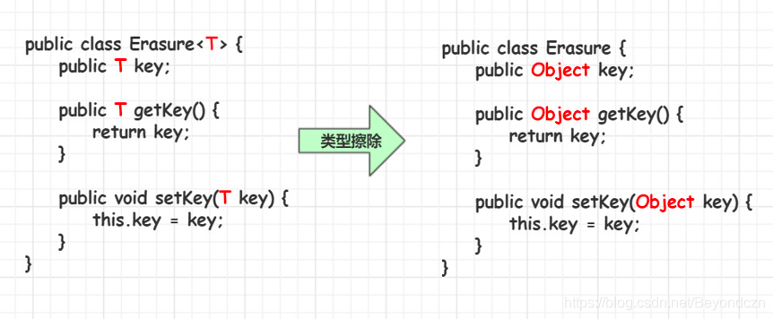
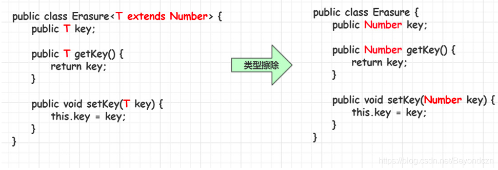
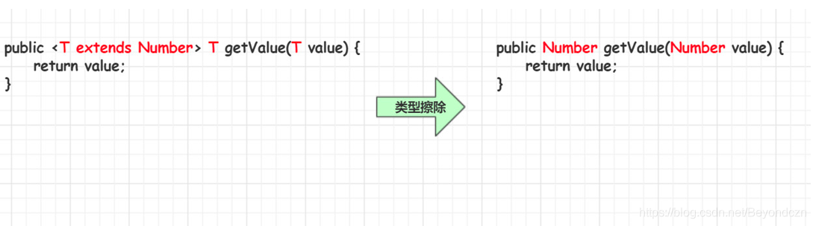
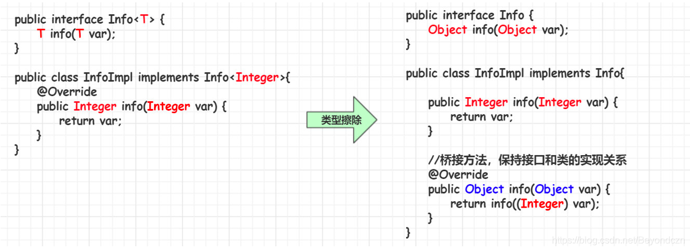

## Java 泛型
### 背景
JAVA推出 泛型 以前，程序员可以构建一个元素类型为Object的集合，该集合能够存储任意的数据类型对象，而在使用该集合的过程中，需要程序员明确知道存储每个元素的数据类型，否则很容易引发ClassCastException异常。

###  概念
* Java泛型（generics）是JDK5中引入的一个新特性，泛型提供了 **编译时类型安全监测机制**，该机制允许我们在编译时检测到非法的类型数据结构。
* 泛型的本质就是 **参数化类型**，也就是所操作的数据类型被指定为一个参数。

### 好处
* 类型安全
* 消除了强制类型的转换

### 类型
* E - Element (在集合中使用，因为集合中存放的是元素)
* T - Type（表示Java 类，包括基本的类和我们自定义的类）
* K - Key（表示键，比如Map中的key）
* V - Value（表示值）
* N - Number（表示数值类型）
* ？ - （表示不确定的java类型）
* S、U、V - 2nd、3rd、4th types

### 泛型类
#### 使用语法
```text
    类名<具体的数据类型> 对象名 = new 类名<具体的数据类型>();
```
Java1.7以后，后面的<>中的具体的数据类型可以省略不写
```text
    类名<具体的数据类型> 对象名 = new 类名<>();
```
<br/>
参考代码：Test01

#### 泛型类注意事项
* 泛型类，如果没有指定具体的数据类型，此时，操作类型是Object
* **泛型的类型参数只能是类类型，不能是基本数据类型**
* 泛型类型在逻辑上可以看成是多个不同的类型，但实际上都是相同类型

```java
public class Demo {
    public static void main(String[] args) {
        Generic<String> strGeneric = new Generic<String>();
        Generic<Integer> intGeneric = new Generic<Integer>();
        intGeneric.getClass() == strGeneric.getClass();  // true
    }
}

class Generic<T> {
    T t;
}
```

可以结合后面的泛型擦除理解，泛型擦除之后 `Generic<String>` 和 `Generic<Integer>` 都是Generic类。

#### 从泛型类派生子类
* 子类也是泛型类，子类和父类的泛型类型要一致
<br/>
参考代码：Test02
* 子类不是泛型类，父类要明确泛型的数据类型
<br/>
参考代码：Test03

### 泛型接口
#### 泛型接口的定义语法
```text
interface 接口名称 <泛型标识，泛型标识，…> {
    泛型标识 方法名();
    .....
}
```

#### 泛型接口的使用
* 实现类也是泛型类，实现类和接口的泛型类型要一致
* 实现类不是泛型类，接口要明确数据类型
<br/>
参考代码：Test04

### 泛型方法
#### 定义
泛型方法是**在调用方法的时候指明泛型的具体类型**。

#### 语法
```text
修饰符 <T，E, ...> 返回值类型 方法名(形参列表) { 方法体... }
```

#### 说明
* public与返回值类型中间非常重要，可以理解为声明此方法为泛型方法。
* 只有声明了的方法才是泛型方法，泛型类中的使用了泛型的成员方法并不是泛型方法。
* <T>表明该方法将使用泛型类型T，此时才可以在方法中使用泛型类型T。
* 与泛型类的定义一样，此处T可以随便写为任意标识，常见的如T、E、K、V等形式的参数常用于表示泛型。

#### 泛型方法与可变参数
```text
public <E> void print(E... e) {
    for (E e1 : e) {
        System.out.println(e);
    }
}
```

#### 泛型方法总结
* 泛型方法能使方法独立于类而产生变化
* 如果static方法要使用泛型能力，就必须使其成为泛型方法
```text
/**
* 静态的泛型方法，采用多个泛型类型
*/
public static <T,E,K> void printType(T t, E e, K k) {
    System.out.println(t + "\t" + t.getClass().getSimpleName());
    System.out.println(e + "\t" + e.getClass().getSimpleName());
    System.out.println(k + "\t" + k.getClass().getSimpleName());
}
```
参考代码：Test05

### 类型通配符
#### 定义
* 类型通配符一般是使用"?"代替具体的类型实参。
* 所以，**类型通配符是类型实参，而不是类型形参**

参考代码：Test07
#### 类型通配符的上限
```text
类/接口<? extends 实参类型>
```
要求该泛型的类型，只能是实参类型，或实参类型的子类类型。

#### 类型通配符的下限
```text
类/接口<? super 实参类型>
```
要求该泛型的类型，只能是实参类型，或实参类型的父类类型。

参考代码：Test08

### 类型擦除
#### 定义
泛型是Java 1.5版本才引进的概念，在这之前是没有泛型的，但是泛型代码能够很好地和之前版本的代码兼容。
那是因为，**泛型信息只存在于代码编译阶段，在进入JVM之前，与泛型相关的信息会被擦除掉**，我们称之为–类型擦除。

#### 分类
##### 无限制类型擦除


参考代码：Test09#fun1()

##### 有限制类型擦除


参考代码：Test09#fun2()

##### 擦除方法中类型定义的参数


参考代码：Test09#fun2()

##### 桥接方法


参考代码：Test09#fun3()

### 泛型与数组
#### 泛型数组的创建
* 可以声明带泛型的数组引用，但是不能直接创建带泛型的数组对象
* 可以通过java.lang.reflect.Array的newInstance(Class,int)创建T[]数组

参考代码：Test10

### 泛型和反射
参考代码：Test11


